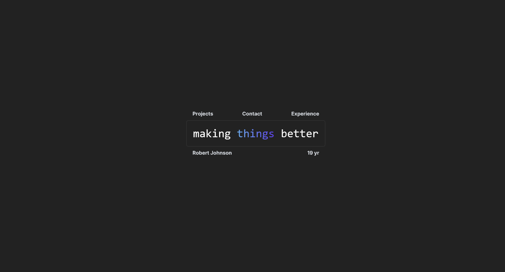

  

  <a href="#about">About</a> •
  <a href="#Features">Features</a> •
  <a href="#technologies-used">Technologies Used</a> •
  <a href="#setup-and-usage">Setup and Usage</a> •
  <a href="#roadmap">Roadmap</a> •
  <a href="#contributing">Contributing</a> •
  <a href="#license">License</a>

# Welcome 👋

Welcome to my portfolio repository! Here, you'll find the code and assets for my professional portfolio website. Coding has been my passion since I was 9 years old—I vividly remember what started it all and it as accidentally discovering what the inspect button did on Coolmath Games! 😄

This portfolio marks my first step in showcasing my work. As a full-stack engineer, I excel in backend development while continuously refining my frontend design skills. While I acknowledge areas for improvement in design, I'm dedicated to honing these skills with each project.

This portfolio reflects my current capabilities and represents the beginning of my professional journey. Thank you for visiting, and I'm eager to share more of my work with you!

Current Version: **v1.0.0**

## Features ✨

- **Experience:** Detailed listing of professional experience using interactive cards.
- **Projects:** Highlights of significant projects with descriptions and key details.
- **Skills:** Overview of technical skills categorized by tools, frameworks, and languages.
- **Contact:** Ways to get in touch with me for potential opportunities.

## Technologies Used 🛠️

- **Next.js:** React framework for building the frontend.
- **Tailwind CSS:** Utility-first CSS framework used for styling.
- **Next.js Font Optimization:** Integration of Google Fonts for typography needs.
- **JSON Data Handling:** Utilization of JSON files for managing job listings and project details.

## Roadmap 🗺️

Future updates for Version 2.0 may include:

    Enhanced UI/UX improvements.
    Integration of additional project details and case studies.
    Dynamic content loading using server-side rendering.

Your feedback and suggestions are welcome to improve this portfolio!

## Contributing 🤝

Contributions are welcome! Fork this repository, create your branch, commit your enhancements, and submit a pull request.

## License 📜

This project is licensed under the MIT License - see the LICENSE file for details.